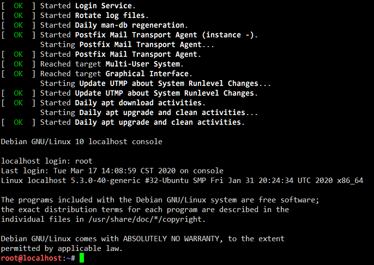

# 准备你的容器环境

## 构建容器的根文件系统（rootfs）

容器的根文件系统和完整操作系统的根文件系统并无太大区别，都包含了一个完整的操作系统目录结构和必要的文件。下面介绍三种构建容器根文件系统的方式。

**本次实验推荐使用 LXC 镜像。**

### 自己编写 init 程序与使用 BusyBox 构建根文件系统

[实验一中](../../lab-1/initrd/README.md)介绍的两种构建初始内存盘（initrd）的方式在这里可以直接使用。唯一的区别是，在将文件放置妥当后，你不再需要将它们打包为 `initrd.cpio.gz` 文件，而是可以在容器中直接使用。如果你准备采用这两种方式，可以直接阅读实验一文档的相关章节。

### 从 LXC 镜像库下载容器镜像

[Linux Containers](https://linuxcontainers.org/)（LXC）是一个系统容器实现，其使用 Linux 的容器技术运行完整的 Linux 子系统。由于容器直接使用主机的内核，没有了虚拟化中间层，与传统虚拟机（KVM, VMware）相比更轻便。

LXC 提供了多种操作系统镜像，你可以从 <https://us.images.linuxcontainers.org/images/> 直接选择下载（请下载 amd64 架构下 `default` 中的 `rootfs.tar.gz` 或 `rootfs.tar.xz` 文件）。不同的 Linux 发行版镜像不影响本实验的后续内容，但如果你不了解它们的区别的话，我们推荐 [Ubuntu 18.04](https://images.linuxcontainers.org/images/ubuntu/bionic/amd64/default/)、[Ubuntu 20.04](https://images.linuxcontainers.org/images/ubuntu/focal/amd64/default/) 或 [Debian Buster](https://images.linuxcontainers.org/images/debian/buster/amd64/default/) 的镜像。

下载到的打包 rootfs 文件只需要解压到一个新的目录即可：

```shell
mkdir rootfs/
cd rootfs/
tar zxf ../rootfs.tar.gz  # 或 tar Jxf ../rootfs.tar.xz
```

Vlab 平台的虚拟机即是 LXC 系统容器，但本实验不对 LXC 的实现作过多探究。

## 使用 chroot 与 systemd-nspawn 体验隔离环境与容器技术

chroot 是一个用于限制进程可以看见的 root 目录（根目录）的机制。在 chroot 之后产生的所有子进程，在正常情况下是无法看见 chroot 目录以外的内容的。尽管实际的容器并不使用 chroot（后面会讲到），理解它仍然是理解容器原理的重要的一步。

在你准备好的 BusyBox 或 LXC 系统镜像目录中运行 `chroot . /bin/sh` 或 `chroot . /bin/bash`，即可 chroot 进入这个系统镜像并对文件系统进行一些操作。如果你使用 LXC 镜像，你甚至可以在这里进行 `apt update` 等包管理操作。

这只是一个非常简单基础的隔离。root 用户可以轻易脱离不加额外限制的 chroot 监狱，并且 chroot 不阻止其他访问系统资源或其他进程的方式（你可以试试在 chroot 环境下执行 `reboot`——注意保存未完成的工作）。

### systemd-nspawn

作为一个对比，systemd-nspawn 是一个最小化但完整的容器实现。你可以使用软件包管理器安装 `systemd-container` 来获得 `systemd-nspawn` 命令。

systemd-nspawn 的用法与 chroot 类似，首先 `cd` 到存有容器系统镜像的目录，然后运行 `systemd-nspawn`，你就可以得到一个 shell。尽管这个 shell 看起来与 chroot 中的 shell 没有什么区别，但是尝试使用某些命令就会发行明显的不同。下面列出几个例子，你可以自己分别在 systemd-nspawn 中和 chroot 中运行并比较：

```shell
reboot
mount  # 查看挂载点
dd if=/dev/sda of=test bs=64k count=1  # 尝试访问设备文件
echo $$  # 检查 shell 本身的 PID
```

!!! note "错误处理"

    如果你使用 systemd-nspawn 时遇到了下面这个报错:

    ```text
    Failed to read machine ID from container image: Invalid argument
    ```

    请向容器镜像中的 `/etc/machine-id` 文件中写入 `0123456789abcdef0123456789abcdef`，然后重新尝试运行.

### 使用 systemd-nspawn 启动一个容器

与 chroot 不同，systemd-nspawn 作为一个完整的容器实现，是可以启动容器中的操作系统的。方便起见，这一步推荐使用 **LXC 镜像**。

为了确保你能够登录进容器系统中的用户，首先需要为 root 用户设置密码（或者清除密码）。使用 chroot 或 systemd-nspawn 进入容器的根文件系统，运行 `passwd root` 设置密码或 `passwd -d root` 清除密码，然后退出这个 shell。

再次使用 systemd-nspawn 将这个文件系统作为容器运行，不过这一次加上 `--boot` 参数。该参数会让 systemd-nspawn 尝试运行文件系统中的 init 程序（而不是一个 shell），从而“启动”这个文件系统中的操作系统。看到提示后，你就可以输入用户名 root 和密码登录进系统了，你甚至可以 `poweroff` 或 `reboot` 这个容器中的系统而不用担心会导致主机被关机或重启。



## 准备你的容器

在你准备好 rootfs 之后，可以将本页底部助教编写的一个示例程序保存为 `main.c` 并编译运行它：

```shell
gcc -o lab4 main.c
./lab4 rootfs/ /bin/bash
```

这时候你就能看到一个“容器”中的 shell 了。当然了，这里的“容器”加上了双引号是因为它仅仅是一个 chroot 程序，因此接下来的任务就是对这个程序进行修改升级（你也可以选择自己从头编写一个）。

## 参考资料

- [chroot - Debian Wiki](https://wiki.debian.org/chroot)
- [nspawn - Debian Wiki](https://wiki.debian.org/nspawn)

## 示例程序

```c
#include <stdio.h>
#include <unistd.h>
#include <sys/types.h> // For wait(2)
#include <sys/wait.h>  // For wait(2)

const char *usage =
"Usage: %s <directory> <command> [args...]\n"
"\n"
"  Run <directory> as a container and execute <command>.\n";

void error_exit(int code, const char *message) {
    perror(message);
    _exit(code);
}

int main(int argc, char **argv) {
    if (argc < 3) {
        fprintf(stderr, usage, argv[0]);
        return 1;
    }
    if (chdir(argv[1]) == -1)
        error_exit(1, argv[1]);

    pid_t pid = fork();
    if (pid == 0) {
        // Child goes for target program
        if (chroot(".") == -1)
            error_exit(1, "chroot");
        execvp(argv[2], argv + 2);
        error_exit(255, "exec");
    }

    // Parent waits for child
    int status, ecode = 0;
    wait(&status);
    if (WIFEXITED(status)) {
        printf("Exited with status %d\n", WEXITSTATUS(status));
        ecode = WEXITSTATUS(status);
    } else if (WIFSIGNALED(status)) {
        printf("Killed by signal %d\n", WTERMSIG(status));
        ecode = -WTERMSIG(status);
    }
    return ecode;
}
```
